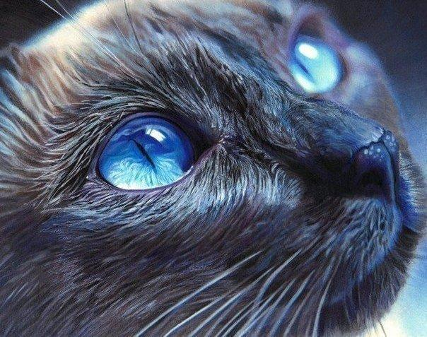
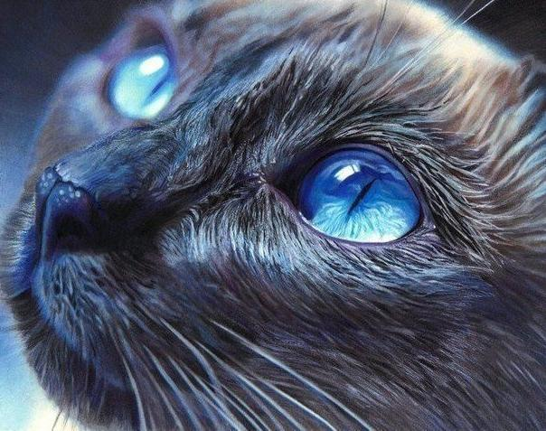

# libjpeg_example

small test project created to try libjpeg library.

source code is written on C language.
can be build on linux platform by make utility.

requires libjpeg library.

the following functionalities are supported:
 * read jpeg file and decode it into plain RGB data
 * print help message
 * reduce the quality of the image
 * make monochrome image
 * mirror the image horizontally
 * scale the image
 * encode to jpeg format and write to file

results examples:






output examples:
```
./jpeg_example --in=./source.jpeg --out=output.jpeg
Done. file output.jpeg has been created.
```
```
./jpeg_example --help
Usage: main [OPTION]... [FILE]...
Redecode the given jpeg image file.

Options:
  --in=<input file>		specify a source image file name
  --out=<output file>		specify a destination image file name
  --quality=<quality value>	specify a value of output image quality [1:100]
  --no-color			to monochrome image
  --mirror			to mirror image horizontally
  --scale=<scale value>		to scale image [0.1:10.0]
  --help			display this help and exit

Exit status:
 0	if OK,
 1	in case of problem.
```

